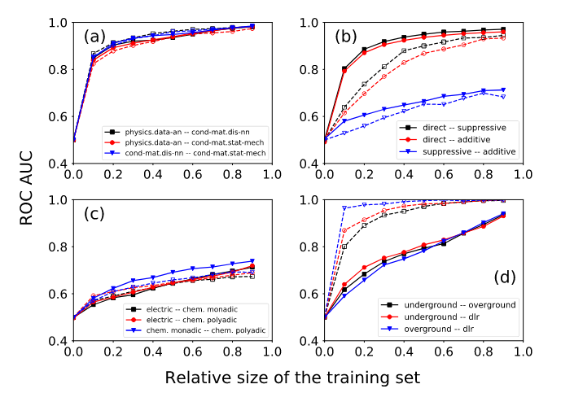

# Embedding Reconstruction - Experiment 28
# Preface
## Contents

- [Embedding Reconstruction - Experiment 28](#embedding-reconstruction---experiment-28)
- [Preface](#preface)
	- [Contents](#contents)
	- [Metadata](#metadata)
	- [Relevant scripts](#relevant-scripts)
- [Summary](#summary)
	- [TL;DR](#tldr)
	- [Experimental Goal](#experimental-goal)
	- [Hypotheses (if applicable)](#hypotheses-if-applicable)
- [Methods](#methods)
	- [Data](#data)
	- [Procedure](#procedure)
- [Results](#results)
- [Analysis](#analysis)
- [Future Work](#future-work)

## Metadata
- Project ID: EMB_ex28
- Researchers: Daniel Kaiser
- Version history:

| Version  | Date Designed | Date Conducted | Date Analyzed | Notes                                                        |
| -------- | ------------- | -------------- | ------------- | ------------------------------------------------------------ |
| *v0.1* | 2023-02-23    | 2022-02-27     | 2022-02-27    | Prototyped workflow |
| **v1.0** | 2023-02-27    | 2022-02-27     | 2022-02-XX    | XXX |

## Relevant scripts

The experimental simulations were run through the Python script `workflow/[operative/active]/ex28/EMB_ex28_logreg-degree.py`. A dataframe was created within the workflow and the resultant dataframe `results/dataframes/dataframe_EMB_ex28[version]_DK_[date].csv` was treated as the input data to the analysis in `notebooks/viz/analysis_EMB_ex28.ipynb`, a Jupyter notebook.

---

# Summary
## TL;DR

X

## Experimental Goal

Reproduce Naive Bayes paper's results (under "DC" classifier) for real duplexes.

## Hypotheses (if applicable)

We should see quanlitatively equivalent behavior to the Naive Bayes classifier paper, reproduced below (solid lines):

Note that N2V is merely a proxy for community structure as instantiated above; hence, utilizing distance within embedding space may not exactly reproduce previous results.

---

# Methods
## Data

We utilize four real multiplexes:

- arXiv collaboration network
- _C. Elegans_ connectome
- _Drosophila_ genetic interaction network
- London transportation network

Within these multiplexes, we induce a duplex and restrict our attention therein; respectively, these are:

- physics.data-an, cond-mat.dis-nn (2, 6)
- electric, chem. monadic (1, 2)
- direct, suppressive (1, 2)
- underground, overground (1, 2)

## Procedure
1. [**Set-up**] Load dataset
2. [**Set-up**] Calculate total aggregate $A = \alpha \cup \beta$.
3. [**Set-up**] Observe training set $\Theta = \theta_{\alpha} \cup \theta_{\beta}$ of relative size (per layer) $\theta$.
4. [**Set-up**] Form remnants $\mathcal{R}_{\alpha}, \mathcal{R}_{\beta}$ and aggregate $\tilde{A} = A - \Theta$.
5. [**Embedding**] Embed remnants using N2V into vector sets $\mathcal{E}_{\alpha}, \mathcal{E}_{\beta}$
6. [**Feature calculations**] Calculate degrees sequences $k^{\alpha}, k^{\beta}$ of $\mathcal{R}_{\alpha}, \mathcal{R}_{\beta}$.
7. [**Feature calculations**] Calculate configuration degrees
   $$
   \forall e = (i, j) \in \tilde{A} \qquad d_e = \frac{k_i^{\alpha}k_j^{\alpha}}{k_i^{\alpha}k_j^{\alpha} + k_i^{\beta}k_j^{\beta}}
   $$
8. [**Feature calculations**] Calculate edge distances in each embedded remnant
   $$
   \forall e = (i, j) \in \tilde{A} \qquad d_e^{\alpha} = \| \mathcal{E}_{\alpha}[i] - \mathcal{E}_{\alpha}[j] \|,\,\, d_e^{\beta} = \| \mathcal{E}_{\beta}[i] - \mathcal{E}_{\beta}[j] \|
   $$
10. [**Model training**] Train a logistic regression classifier on $\{ d_e, d_e^{\beta}, d_e^{\beta} \}$.
11. [**Reconstruction**] Reconstruct $\tilde{A}$.
12. [**Measure performance**] Measure performance using accuracy, AUROC and AUPR.
13. [**Set-up**] Repeat (3) - (9) for some range of $\theta$.

---

# Results

---

# Analysis

---

# Future Work

`EMB_ex29` will expand this analysis to include component-biases in feature preprocessing as well.
